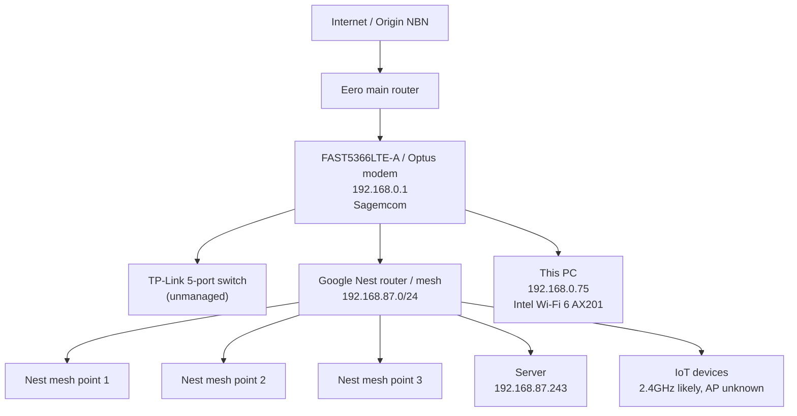

This is a strong next layer. It has moved LanInspector from “packet table with MAC/IP sightings” into a proper **device identity enrichment tool**. I found PR #1 in your linked repo titled **“[feature] add vendor hostname and port enrichment”**, and the summary matches what you pasted: expanded device model, passive DNS/mDNS and DHCP analyzers, OUI lookup, reverse DNS fallback, selected-row TCP port scan, and WPF table updates. 

The validation status is also sensible: core project builds cleanly, `git diff --check` passes, and the full WPF solution needs to be built on Windows because this Linux host lacks the WindowsDesktop SDK targets. 

## My review verdict

I would treat this as a good **safe passive enrichment milestone**. It intentionally avoids Nmap, SNMP, LLDP/CDP and topology claims, which is the right sequencing. 

The most valuable things you have added are:

```text
ARP              → reliable local MAC/IP mapping
DHCP             → hostname, vendor class, DHCP server hints
DNS/mDNS         → observed names without overwriting hostname incorrectly
OUI CSV          → vendor enrichment
Reverse DNS      → fallback identity lookup
TCP port scan    → selected-device service check
Run history      → session comparison
BPF presets      → easier targeted capture
```

That is exactly the foundation needed before topology inference.

---

## Important review notes before merging

### 1. The OUI file is currently too small

You have added a CSV-backed lookup, which is correct, but the current file only has a handful of prefixes. That means many devices will still show blank vendor values.

Next improvement: add a larger generated `oui.csv`, ideally converted from one of:

```text
IEEE OUI registry
Wireshark manuf file
mac-vendor database
```

Keep the bundled file local and lightweight, but provide a script to regenerate it.

Suggested docs addition:

```text
scripts/update-oui.ps1
scripts/update-oui.sh
```

### 2. mDNS support is still basic DNS-format parsing

This is okay for now, but mDNS becomes much more useful when you parse:

```text
PTR
SRV
TXT
A
AAAA
```

Right now, device names may still be missed because many mDNS service announcements come through PTR/SRV/TXT chains rather than simple A answers.

Next target:

```text
_googlecast._tcp.local
_ssh._tcp.local
_http._tcp.local
_smb._tcp.local
_airplay._tcp.local
_raop._tcp.local
_printer._tcp.local
```

### 3. DNS observed names should stay separate from hostnames

You already fixed the dangerous case where a device querying `google.com` could accidentally become named `google.com`. That is very important.

Keep this rule:

```text
DNS question names      → ObservedNames / QueriedNames only
DNS/mDNS A/AAAA answer  → possible hostname for matching IP
DHCP hostname           → strong hostname
mDNS .local hostname    → strong hostname
Reverse DNS             → medium hostname
```

Eventually split `ObservedNames` into:

```text
ObservedHostNames
QueriedDnsNames
ServiceNames
```

Otherwise the list will become noisy.

### 4. DHCP MAC normalization is important

Good fix. Without this, DHCP and ARP would create duplicate rows for the same device.

I would now standardise the whole app on one internal format:

```text
AABBCCDDEEFF
```

and only format as:

```text
AA-BB-CC-DD-EE-FF
```

in the UI.

### 5. TCP scan should show scan scope clearly

The “Scan Ports” button is good, but the UI should make it very clear that it is scanning only **common ports**, not a full port range.

Maybe label it:

```text
Scan Common Ports
```

or show a tooltip:

```text
Checks selected common TCP ports only. This is not a full Nmap-style scan.
```

---

## What I would add next

The next major feature should be:

# Route-aware device classification

This is directly tied to your home network problem where your PC is on:

```text
192.168.0.75
```

but your server is on:

```text
192.168.87.243
```

and SSH still works.

Add a new field:

```text
Reachability
```

Values:

```text
Local L2
Routed
Reachable TCP only
Unreachable
Unknown
```

### Logic

For each IP on a device:

```text
If IP is in same subnet as any local interface:
    Local L2

Else if TCP port scan succeeds or ping succeeds:
    Routed

Else if route table has a path but no port responds:
    Route exists, service unavailable

Else:
    Unreachable / Unknown
```

### UI columns to add

```text
Segment
Reachability
Route / Gateway
Best Connect Action
```

Example for your server:

```text
Display name: Home Server
IP: 192.168.87.243
Segment: 192.168.87.0/24
Reachability: Routed
Route: via 192.168.0.1
Open ports: 22 SSH
Action: ssh gagneet@192.168.87.243
```

This would make LanInspector immediately useful for your current SSH issue.

---

## Then add a “Known Devices” feature

You need a way to mark important devices like:

```text
Home Server
NAS
Printer
Router
Google Nest
Eero
Optus FAST5366LTE-A
```

Add a JSON config:

```json
{
  "knownDevices": [
    {
      "name": "Home Server",
      "type": "Server",
      "knownIps": ["192.168.0.148", "192.168.87.243"],
      "sshUser": "gagneet",
      "sshPort": 22,
      "tags": ["critical", "server"]
    }
  ]
}
```

Then add a panel:

```text
Critical Devices
```

Example:

```text
Home Server
Status: Online
Current IP: 192.168.87.243
Previous IP: 192.168.0.148
SSH: Open
Connect: ssh gagneet@192.168.87.243
Warning: Device is reachable through routed Google Nest subnet.
```

This should be the next practical UX enhancement.

---

## Next PR recommendation

I would create the next PR as:

```text
[feature] add route-aware reachability and known critical devices
```

Scope:

```text
1. Detect local interfaces and subnets
2. Detect default gateway per interface
3. Classify each device IP as Local L2, Routed, or Unknown
4. Add route check for selected device
5. Add known-devices.json
6. Add Critical Devices panel
7. Show SSH command when port 22 is open
```

Avoid topology diagrams until this is stable.

---

## Later backlog

After route-aware classification, I would add these in order:

```text
1. SSDP / UPnP discovery
2. ARP or ping sweep for configured subnets
3. Device detail drawer / side panel
4. Traffic flow table
5. Alerts: new device, changed IP, gateway MAC changed
6. Topology tab with confidence levels
7. Optional Nmap integration
8. Optional SNMP for managed switches
9. Optional remote sensor agent
```

For your hardware, the topology tab should show confidence, not pretend certainty:

```text
Certain   → local interface, default gateway, ARP/DHCP evidence
Likely    → subnet/gateway/DHCP inference
Inferred  → vendor + service + route pattern
Unknown   → insufficient evidence
```

---


Yes — the current app is now a good **capture-and-enrichment prototype**, but it is not yet a useful “network operations dashboard”. Your latest UI shows the right data beginning to appear: device names, vendors, mDNS/reverse-DNS evidence, ports column, and seen-via values. The repo README also confirms the current architecture is still .NET 8 WPF with SharpPcap/PacketDotNet, passive ARP/DNS/mDNS/DHCP parsing, OUI lookup, reverse DNS, and opt-in common TCP scans.  

The next level should be: **LanInspector = SniffNet-style traffic intelligence + home-network topology + safe device actions + optional DNS visibility layer.**

---

## 1. First major decision: keep WPF or move UI stack?

For Windows-only, WPF is fine. But if you want Ubuntu and macOS later, do **not** keep building a large WPF-only UI.

I would split the project into:

```text
LanInspector.Core       Packet capture, analyzers, device model
LanInspector.Agent      Local capture service / sensor process
LanInspector.Desktop    Cross-platform UI
LanInspector.DnsBridge  Optional Pi-hole / AdGuard / DNS integration
```

Recommended UI stack:

| Option                    | Recommendation             | Why                                           |
| ------------------------- | -------------------------- | --------------------------------------------- |
| WPF                       | Keep short-term            | Fastest for current Windows testing           |
| Avalonia UI               | Best next step             | C#/.NET, cross-platform Windows/Linux/macOS   |
| WinUI 3                   | Not ideal                  | Windows-only                                  |
| Electron/Tauri + React    | Good UX, more moving parts | Better if you want web-style dashboard        |
| Rust + Iced like SniffNet | Good but bigger rewrite    | SniffNet uses Rust/Iced and is cross-platform |

Given your code is already .NET, I would move the UI to **Avalonia** later rather than rewrite everything in Rust.

---

## 2. What SniffNet does that you should copy conceptually

SniffNet’s official feature list includes adapter selection, traffic filters, PCAP import/export, overall traffic statistics, real-time traffic charts, local connection identification, remote host domain/ASN lookup, service/protocol identification, application-level traffic, favourites, notifications, blacklists, search, and custom themes. ([Sniffnet][1])

Your app should not simply clone SniffNet. It should become more useful for your situation by adding:

```text
“Explain my home network in plain English”
“Where is my server?”
“Which subnet/router is this device behind?”
“Can I connect to this device?”
“Is this device suspicious?”
“Why can/can’t I SSH to this?”
```

That is the difference. SniffNet is excellent for traffic monitoring; LanInspector should become **home-network diagnosis and topology intelligence**.

---

## 3. The new UX should not be one big grid

Your current table is useful for debugging, but not for day-to-day use. Move to a dashboard with cards and drill-downs.

### Proposed UX layout

```text
Top bar:
  Network Health | Devices | Traffic | Topology | DNS | Alerts | Tools | Settings
```

### Dashboard tab

Cards:

```text
Current connection
  Wi-Fi: Intel AX201
  IP: 192.168.0.75
  Subnet: 192.168.0.0/24
  Gateway: 192.168.0.1
  Network role: Optus/FAST5366LTE-A side

Devices
  12 seen
  7 local L2
  5 routed / other subnet
  3 unknown names
  2 open SSH
  1 router/gateway

Traffic
  Live packets/sec
  DNS queries/min
  Top local talker
  Top remote destination

Warnings
  Server moved subnet
  Unknown device appeared
  Device has Telnet open
  Gateway MAC changed
```

### Devices tab

Instead of showing all fields at once, use a modern master-detail layout:

```text
Left: device list
Right: selected device details
```

For each device, show:

```text
Friendly name
Device type
IP/MAC
Vendor
Network segment
Reachability: Local / Routed / Unreachable
Open ports
Seen via
Last seen
Actions: SSH, HTTP, Ping, Trace, Scan, Label
```

### Device detail page

For a selected server:

```text
Home Server

Current address
  192.168.87.243

Other known addresses
  192.168.0.148

How to connect
  SSH available
  ssh gagneet@192.168.87.243

How this PC reaches it
  This PC: 192.168.0.75
  Gateway: 192.168.0.1
  Target: 192.168.87.243
  Classification: Routed, not local ARP

Observed services
  22 SSH
  80 HTTP
  443 HTTPS

Evidence
  ARP
  mDNS
  Reverse DNS
  TCP scan
```

That is much more useful than the current grid.

---

## 4. Add traffic analytics like SniffNet

Your current app is device-focused. Add a **Flow Engine**.

A flow is:

```text
Source IP
Source port
Destination IP
Destination port
Protocol
Bytes
Packets
First seen
Last seen
Direction
Service label
Process name if local process is known
```

### Traffic panels to add

| Panel                  | What it shows                                          |
| ---------------------- | ------------------------------------------------------ |
| Live throughput        | packets/sec, bytes/sec                                 |
| Top devices            | which LAN device is most active                        |
| Top services           | HTTPS, DNS, mDNS, SSH, SMB                             |
| Top destinations       | IP/domain/ASN where possible                           |
| Local conversations    | device-to-device traffic                               |
| Internet conversations | LAN-to-WAN traffic                                     |
| DNS queries            | which device asked for what domain                     |
| Suspicious traffic     | unknown destinations, repeated failures, unusual ports |

SniffNet identifies hosts, services, programs, real-time connections and traffic statistics; you can reuse that idea but explain it in plain English. ([GitHub][2])

Example layman explanation:

```text
192.168.87.24 is an Espressif IoT device.
It mostly talks to:
  - your gateway
  - mDNS multicast
  - cloud endpoints over HTTPS

No risky open ports were found.
```

---

## 5. Add safe device actions

For every selected device, add an **Actions** area.

```text
Ping
Trace route
Scan common ports
Open web page
SSH
Copy SSH command
Open Windows Terminal
Open PowerShell
Open Remote Desktop
Open SMB share
Add alias
Mark as trusted
Mark as unknown
Ignore device
```

### SSH / terminal action

For Windows, you can launch Windows Terminal:

```csharp
Process.Start(new ProcessStartInfo
{
    FileName = "wt.exe",
    Arguments = $"ssh gagneet@192.168.87.243",
    UseShellExecute = true
});
```

Fallback:

```csharp
Process.Start(new ProcessStartInfo
{
    FileName = "powershell.exe",
    Arguments = "-NoExit -Command \"ssh gagneet@192.168.87.243\"",
    UseShellExecute = true
});
```

In the UI, show:

```text
Connect via SSH
ssh gagneet@192.168.87.243
```

Do not store SSH passwords. If you later support credentials, use Windows Credential Manager or OS keychain only.

---

## 6. Add route-aware topology

This is the most important next feature for your actual home network.

You want to know:

```text
Eero -> Optus modem -> Google Nest -> Device
```

The app can infer parts of this, but it cannot know everything unless the routers/switches expose the data.

### What LanInspector can infer now

```text
192.168.0.xxx     likely Optus/FAST5366LTE-A side
192.168.87.xxx    likely Google Nest side
192.168.0.1       Optus gateway / Sagemcom
192.168.87.1      likely Google Nest gateway
```

### What it cannot reliably know from your Windows Wi-Fi client alone

```text
Exact TP-Link switch port
Whether a device is connected to Google Nest 2.4GHz or 5GHz
Which Google mesh node a different device is using
All traffic between two other devices
All IoT devices if they are quiet and do not broadcast
```

To get those, you need one or more of:

```text
Router API / app export
Managed switch with SNMP or port mirroring
A Linux/Raspberry Pi sensor on each subnet
Google Nest/Eero integration if exposed
Putting DNS/DHCP under your control
```

---

## 7. Why you cannot see 2.4GHz vs 5GHz for all devices yet

From your PC, packet capture sees network frames from your adapter’s perspective. It does not automatically receive the association table from Google Nest, Eero, or the Optus modem.

To know **2.4GHz vs 5GHz**, you need the access point’s client association data.

Possible sources:

| Source                   |           Can show 2.4/5GHz? | Notes                                      |
| ------------------------ | ---------------------------: | ------------------------------------------ |
| Windows Wi-Fi API        |         Only for your own PC | Shows current SSID/BSSID/radio             |
| Google Home/Nest app/API |    Possibly for Nest clients | Depends on accessible API                  |
| Eero app/API             |    Possibly for Eero clients | Unofficial APIs may change                 |
| Router admin page        |                    Sometimes | FAST5366LTE-A may expose Wi-Fi client info |
| SNMP on AP/router        |                    Sometimes | Consumer routers often limited             |
| Wi-Fi monitor mode       | Maybe, unreliable on Windows | Requires adapter/driver support            |
| UniFi/Omada/OpenWrt      |                          Yes | Better prosumer hardware                   |

So the app should show:

```text
Wi-Fi band: Unknown
Reason: Router/AP association data not available
How to enable: connect router integration or managed AP source
```

That is better UX than leaving the user guessing.

---

## 8. Add a topology tab with confidence levels

Do not pretend certainty. Show evidence and confidence.

### Existing network chart



In the UI, each edge should show one of:

```text
Confirmed
Likely
Inferred
Unknown
```

Example:

```text
192.168.0.1 is Sagemcom FAST5366LTE-A
Confidence: High
Evidence: reverse DNS mygateway + OUI Sagemcom + ARP gateway
```

```text
192.168.87.243 is behind Google Nest
Confidence: Medium
Evidence: IP subnet 192.168.87.0/24 + routed from 192.168.0.75
```

---

## 9. Add route and gateway detection

For every device, add:

```text
Segment
Reachability
Route
Gateway
Trace
```

Example:

```text
Device: 192.168.87.243
Segment: 192.168.87.0/24
Reachability: Routed
Route: via 192.168.0.1
ARP visible: No
SSH: Open
```

Commands to wrap:

```powershell
Find-NetRoute -RemoteIPAddress 192.168.87.243
tracert -d 192.168.87.243
Test-NetConnection 192.168.87.243 -Port 22
```

This solves your original SSH/server problem directly.

---

## 10. Add active discovery safely

You need passive + active discovery. Passive capture alone will miss quiet IoT devices.

Add opt-in active discovery:

```text
ARP sweep local subnet
ICMP ping sweep
TCP common port scan
mDNS browse
SSDP/UPnP discovery
Optional Nmap integration
```

Nmap is widely used for host discovery, port scanning, service/version detection and OS/device fingerprinting. ([Wikipedia][3])

Do **not** make full Nmap scanning the default. Add:

```text
Quick scan
  ARP + ping + common TCP ports

Deep scan
  Nmap service/version detection

Careful scan
  Slower, less noisy, safer for IoT devices
```

---

## 11. Connect to open-source tools instead of rebuilding everything

Use these integrations:

| Need               | Tool/library                   | How to integrate                          |
| ------------------ | ------------------------------ | ----------------------------------------- |
| Packet capture     | SharpPcap / Npcap / libpcap    | Already started                           |
| Deep packet decode | TShark                         | Optional external process                 |
| Port/service scan  | Nmap                           | Optional external process, parse XML/JSON |
| DNS sinkhole       | Pi-hole or AdGuard Home        | API integration, not inside WPF           |
| DNS resolver       | CoreDNS / Technitium / Unbound | Later, if needed                          |
| Topology via SNMP  | SharpSnmpLib                   | If managed switch/router supports SNMP    |
| IDS/security       | Zeek / Suricata                | Optional advanced sensor mode             |
| Remote sensor      | custom .NET/Go agent           | Best way to see other subnets             |
| UI inspiration     | SniffNet                       | Charts, cards, filters, traffic summaries |

Wireshark/TShark is the mature packet-analysis reference point; TShark is the terminal version of Wireshark and can read live capture or saved capture files. ([Wikipedia][4])

---

## 12. DNS: should LanInspector become a DNS server?

I would **not** make the WPF desktop app itself your DNS server.

Instead:

```text
LanInspector should integrate with a DNS service.
```

Best options:

### Option A: AdGuard Home integration

This is probably the best fit for you. AdGuard Home is a free/open-source network-wide DNS server for blocking ads and trackers, covers all home devices after setup, and has API support. ([GitHub][5])

Why it fits:

```text
Cross-platform
Built-in DHCP server
Encrypted upstream DNS support
Per-client configuration
REST API
Good UX
Can monitor network DNS activity
```

AdGuard’s README also explicitly says running your own server lets you choose what is blocked/permitted, monitor network activity, add custom filtering rules, and stay in control. ([GitHub][5])

### Option B: Pi-hole integration

Pi-hole is also a good option. Its docs describe it as a DNS sinkhole that protects devices without client-side software, with caching, a web dashboard, and optional DHCP server capability. ([Pi-hole Documentation][6])

Why it fits:

```text
Very mature
Great community
Runs well on Raspberry Pi / Linux server
Good for ad/tracker blocking
Can optionally do DHCP
```

### What LanInspector should do with DNS

Add a **DNS tab**:

```text
Top queried domains
Top blocked domains
Top clients by DNS volume
Unknown device making many DNS requests
DNS server health
DNS latency
DoH/DoT bypass suspicion
Per-device DNS summary
```

Add integration settings:

```text
DNS provider:
  None
  Pi-hole
  AdGuard Home
  Custom DNS logs
```

---

## 13. Best home-network architecture if you want full visibility

Right now, your topology is consumer-mesh-heavy. That is convenient but opaque.

For better visibility, you need to bring one of these under your control:

```text
DNS
DHCP
Switch
Gateway
Wireless AP controller
```

### Minimum useful improvement

Run **AdGuard Home or Pi-hole** on your server/Raspberry Pi and make all clients use it as DNS.

```text
Benefit:
  You will know which device is asking for which domain.
```

### Better improvement

Make AdGuard/Pi-hole also act as DHCP, but only if you are comfortable turning off DHCP on the router that currently owns the LAN.

```text
Benefit:
  You get reliable client names, leases, MACs and DNS mapping.
```

### Best improvement

Add a small managed switch with port mirroring.

```text
Eero / Optus / Nest
       |
Managed switch
       |-- server
       |-- sensor
       |-- other wired devices
```

```text
Benefit:
  You can mirror traffic to a LanInspector sensor.
```

### Prosumer future option

Replace/augment consumer mesh with something like:

```text
UniFi
TP-Link Omada
OpenWrt
OPNsense/pfSense + managed APs
```

These expose far better client association, Wi-Fi band, AP, VLAN and topology data.

---

## 14. Add sensors for full-network visibility

Your desktop app on Wi-Fi cannot see everything. The correct architecture is:

```text
LanInspector Desktop UI
        |
LanInspector Core database
        |
---------------------------------
| Sensor: Windows PC            |
| Sensor: Linux server          |
| Sensor: Raspberry Pi on LAN   |
| Sensor: optional Nest subnet  |
---------------------------------
```

Each sensor reports:

```text
Interfaces
ARP table
Routes
DHCP observations
DNS/mDNS/SSDP observations
Traffic flows
Open ports from its location
```

This is how you see both:

```text
192.168.0.0/24
192.168.87.0/24
```

without relying on one Wi-Fi adapter.

---

## 15. What to add to the current UI next

Based on your screenshot, the next UI changes should be:

### Replace current grid-first design with cards

Top dashboard cards:

```text
Current Network
  192.168.0.75 via mygateway

Routers
  192.168.0.1 mygateway Sagemcom
  192.168.87.1 likely Google Nest

Critical Devices
  Home Server online at 192.168.87.243
  SSH open

Traffic Now
  7,588 packets captured
  top service: mDNS/DNS/HTTPS

Warnings
  Some 192.168.87.x devices are routed, not local ARP
```

### Add colored status badges

```text
Trusted
Unknown
Router
Server
IoT
Phone
Laptop
Printer
Routed
Local
SSH
Web
Risk
```

### Add a device detail drawer

When a row is selected:

```text
Identity
Network path
Open services
Traffic
DNS names
Evidence
Actions
Notes
```

### Add search and filters

```text
Show only:
  Unknown devices
  Routers
  Servers
  IoT
  Devices with open ports
  Devices seen via DHCP
  Devices on 192.168.87.0/24
  Devices not seen recently
```

---

## 16. Suggested next implementation branches

### PR 2: Route-aware reachability

```text
- Add local subnet detection
- Add Find-NetRoute wrapper on Windows
- Add traceroute wrapper
- Add Reachability column
- Add Segment column
- Add Route/Gateway column
- Add SSH command generation for port 22
```

### PR 3: Device details and actions

```text
- Device detail side panel
- Ping action
- Trace action
- Open web action
- SSH action using Windows Terminal
- Copy connection command
- User alias and trusted/unknown flag
```

### PR 4: Traffic flows

```text
- Flow model
- Aggregate packets into flows
- Bytes/packets per flow
- Top talkers
- Top services
- Local vs internet classification
- Basic charts
```

### PR 5: SSDP/UPnP discovery

```text
- Send SSDP M-SEARCH
- Parse responses
- Fetch LOCATION XML
- Extract friendlyName, manufacturer, modelName
- Identify routers, TVs, media devices, IoT hubs
```

### PR 6: DNS integration

```text
- Add DNS provider abstraction
- Add AdGuard Home integration
- Add Pi-hole integration
- Show DNS query dashboard
- Map DNS clients to LanInspector devices
```

### PR 7: Topology view

```text
- Build graph model: nodes and edges
- Use confidence scoring
- Render graph
- Show evidence for every edge
- Export topology as Mermaid / PNG / JSON
```

---

## 17. Practical topology model

Add these entities:

```csharp
public enum NetworkNodeType
{
    Internet,
    Gateway,
    Router,
    AccessPoint,
    MeshNode,
    Switch,
    Sensor,
    Device,
    Unknown
}

public enum TopologyConfidence
{
    Confirmed,
    High,
    Medium,
    Low,
    Unknown
}

public sealed class TopologyNode
{
    public string Id { get; init; } = "";
    public string DisplayName { get; init; } = "";
    public NetworkNodeType Type { get; init; }
    public string? IpAddress { get; init; }
    public string? MacAddress { get; init; }
    public string? Vendor { get; init; }
}

public sealed class TopologyEdge
{
    public string FromNodeId { get; init; } = "";
    public string ToNodeId { get; init; } = "";
    public string Relationship { get; init; } = "";
    public TopologyConfidence Confidence { get; init; }
    public string Evidence { get; init; } = "";
}
```

Example:

```text
FAST5366LTE-A -> Google Nest
Relationship: upstream/downstream
Confidence: Medium
Evidence: Google Nest subnet 192.168.87.0/24 reachable via 192.168.0.1
```

---

## 18. What “good” looks like for LanInspector

A successful version should answer these questions in plain English:

```text
What network am I connected to?
Which devices are online?
Which devices are routers, servers, IoT, phones or laptops?
Where is my server now?
How do I SSH to it?
Which devices have open ports?
Which devices are talking the most?
Which domains are my IoT devices contacting?
Which devices are on 192.168.0.x vs 192.168.87.x?
Which connections are local vs internet?
Is anything new or suspicious?
Why can’t I see this device?
What extra sensor/router access is needed to see more?
```

That is the original intent.

---

## My recommendation

Do **not** try to turn this into a DNS server and SniffNet clone at the same time.

The best direction is:

```text
1. Keep LanInspector as the network intelligence UI.
2. Add SniffNet-like traffic flow summaries and charts.
3. Integrate with AdGuard Home or Pi-hole for DNS visibility.
4. Add route-aware topology and device actions.
5. Add optional sensors for full LAN/Nest visibility.
6. Move from WPF to Avalonia only after the architecture stabilizes.
```

The next PR I would build is:

```text
[feature] add route-aware topology, device actions, and traffic flow dashboard
```

That will make the app immediately useful on your actual Eero → Optus → Google Nest → switch network.

[1]: https://www.sniffnet.net/ "Sniffnet: comfortably monitor your Internet traffic"
[2]: https://github.com/GyulyVGC/sniffnet "GitHub - GyulyVGC/sniffnet: Comfortably monitor your Internet traffic ️‍♂️ · GitHub"
[3]: https://en.wikipedia.org/wiki/Nmap?utm_source=chatgpt.com "Nmap"
[4]: https://en.wikipedia.org/wiki/Wireshark?utm_source=chatgpt.com "Wireshark"
[5]: https://github.com/AdguardTeam/AdGuardHome "GitHub - AdguardTeam/AdGuardHome: Network-wide ads & trackers blocking DNS server · GitHub"
[6]: https://docs.pi-hole.net/ "Overview of Pi-hole - Pi-hole documentation"

