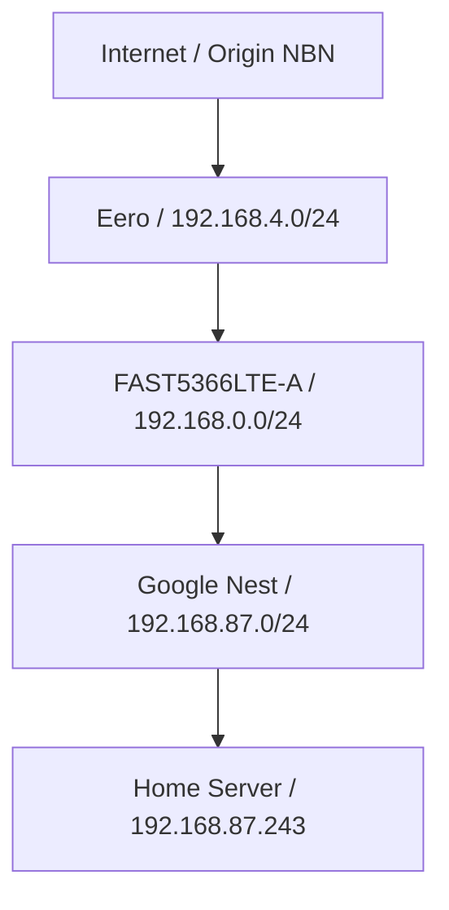

# Next Phase Prompt: Topology, Traffic, Nmap, DNS and Wireshark Integrations

## Purpose

This prompt defines the next meaningful phase for LanInspector after the cross-platform Core/CLI/remote-access work.

The goal is to move LanInspector from a device-discovery and remote-access helper into a practical home-network intelligence tool that can explain:

- what networks/subnets exist;
- what the current machine can and cannot see;
- how routed/NAT networks connect;
- which devices are active;
- which devices expose ports/services;
- which devices generate traffic;
- which DNS destinations are being queried;
- which topology links are confirmed, inferred, or unknown;
- when external tools such as Nmap, TShark/Wireshark, Pi-hole, AdGuard Home, SNMP, or LLDP can add evidence.

This phase should still be safe-by-default. It should not attempt credential attacks, packet injection, router password storage, exploit scanning, or unapproved scans outside user-owned networks.

---

## Current Architecture Assumption

The repository is:

```text
https://github.com/gagneet/lan-sniffer
```

Current architecture after the previous phase:

```text
LanInspector.Core
  Platform-neutral models, analyzers, discovery, route diagnostics contracts, remote access models, known device logic, Tailscale parsing and recommendation engine.

LanInspector.Platform.Windows
  Windows route diagnostics, terminal launcher, capture prerequisite checks.

LanInspector.Platform.Linux
  Linux route diagnostics, terminal launcher, capture prerequisite checks.

LanInspector.Platform.MacOS
  macOS route diagnostics, terminal launcher, capture prerequisite checks.

LanInspector.Cli
  Cross-platform CLI that selects the correct platform service implementation at runtime.

LanInspector.UI
  Windows WPF UI that depends on Core and Platform.Windows.
```

Do not migrate to Avalonia in this PR. The cross-platform CLI should remain the first-class non-Windows interface. Avalonia can be planned later after the core topology and traffic models are stable.

---

## Recommended PR Title

```text
[feature] add topology, traffic flow, nmap, dns and wireshark integrations
```

---

## Scope for This PR

Implement these items now:

1. Full topology model v1.
2. LAN/NAT visibility explanation engine.
3. Traffic flow aggregation model and charts.
4. Nmap integration for opt-in active discovery.
5. TShark/Wireshark integration for deep packet summaries and PCAP export/open workflows.
6. Pi-hole and AdGuard Home integration abstraction with one working provider if time permits.
7. SNMP and passive LLDP foundation.
8. README and user-guide updates.
9. CLI commands for all new capabilities.

Defer these unless the above is complete:

- Avalonia GUI.
- Router password automation.
- Vulnerability scanning.
- IDS/IPS style rule engines.
- Automated router configuration changes.
- Full SNMPv3 credential UX.
- Exact Wi-Fi 2.4GHz/5GHz association unless router/AP integration exposes it.

---

## Design Principles

### 1. Evidence over guesses

Every topology edge or classification must include evidence and confidence.

Example:

```text
Node: Home Server
IP: 192.168.87.243
Classification: Routed device behind Google Nest subnet
Confidence: Medium
Evidence:
  - IP belongs to known subnet 192.168.87.0/24
  - TCP/22 reachable from Optus network
  - Not ARP-visible from 192.168.0.0/24
  - Trace from Optus reaches target in 2 hops
```

### 2. Explain visibility limits

The app must clearly tell the user what it can and cannot see.

Example:

```text
You are connected to 192.168.4.0/24 on Eero.
The target 192.168.87.243 is a private LAN address behind Google Nest.
Your current route exits toward 100.96.x.x, so this router does not know how to reach that internal subnet.
LanInspector cannot see quiet IoT traffic behind Google Nest from this interface unless a sensor, router integration, DNS integration, or mirrored switch is available.
```

### 3. Passive first, active on demand

Passive capture and DNS provider lookups are safe to run continuously. Nmap, subnet sweeps, SNMP walks, and deeper service detection must be user-triggered or explicitly enabled.

### 4. No secrets in source code

Do not commit API tokens, router passwords, SNMP community strings, SSH passwords, or Pi-hole/AdGuard credentials.

Use a local user config file and clearly document secure storage limitations.

### 5. Cross-platform Core and CLI

All new engines and models should live in Core. Platform-specific external tool detection and process execution belong in Platform.* projects. CLI commands must expose the same functionality as the UI where practical.

---

## User Network Context for Validation

Use this as a real-world scenario for manual testing:

```text
Origin NBN / Internet
  -> Eero 6+ router, subnet 192.168.4.0/24
     -> FAST5366LTE-A / Optus modem-router used as downstream LAN/switch, subnet 192.168.0.0/24
        -> Google Nest router/mesh, subnet 192.168.87.0/24
        -> TP-Link unmanaged 5-port desktop switch
```

Known observations:

```text
Windows client on Eero:
  Client IP: 192.168.4.32
  Target: 192.168.87.243:22
  Direct SSH fails
  Trace: 192.168.4.1 -> 100.96.x.x -> timeout

Windows client on Optus:
  Client IP: 192.168.0.75
  Target: 192.168.87.243:22
  Direct SSH succeeds
  Trace: 192.168.0.1 -> 192.168.87.243
```

The application should be able to explain why one path works and the other does not.

---

# Functional Requirements

## 1. Topology Model v1

Add Core models:

```csharp
public enum NetworkNodeType
{
    Internet,
    Gateway,
    Router,
    AccessPoint,
    MeshNode,
    Switch,
    Sensor,
    Device,
    Server,
    DnsServer,
    VpnOverlay,
    Unknown
}

public enum TopologyLinkType
{
    Physical,
    Layer2,
    Routed,
    Nat,
    OverlayVpn,
    DnsObserved,
    Inferred,
    Unknown
}

public enum TopologyConfidence
{
    Confirmed,
    High,
    Medium,
    Low,
    Unknown
}

public sealed class TopologyNode
{
    public string Id { get; init; } = string.Empty;
    public string DisplayName { get; init; } = string.Empty;
    public NetworkNodeType Type { get; init; }
    public string? IpAddress { get; init; }
    public string? MacAddress { get; init; }
    public string? Vendor { get; init; }
    public IReadOnlyList<string> Tags { get; init; } = [];
}

public sealed class TopologyEdge
{
    public string FromNodeId { get; init; } = string.Empty;
    public string ToNodeId { get; init; } = string.Empty;
    public TopologyLinkType LinkType { get; init; }
    public TopologyConfidence Confidence { get; init; }
    public string Evidence { get; init; } = string.Empty;
    public DateTimeOffset ObservedAt { get; init; }
}

public sealed class NetworkTopologySnapshot
{
    public DateTimeOffset CreatedAt { get; init; }
    public IReadOnlyList<TopologyNode> Nodes { get; init; } = [];
    public IReadOnlyList<TopologyEdge> Edges { get; init; } = [];
    public IReadOnlyList<string> Warnings { get; init; } = [];
}
```

Add service:

```csharp
public interface ITopologyService
{
    Task<NetworkTopologySnapshot> BuildSnapshotAsync(CancellationToken cancellationToken);
}
```

Inputs should include:

- local interfaces;
- gateways;
- route diagnostics;
- known devices;
- discovered devices;
- ARP evidence;
- DHCP evidence;
- DNS/mDNS evidence;
- Tailscale devices and routes;
- Nmap results;
- SNMP/LLDP evidence when available.

### Topology Confidence Rules

Use rules similar to:

```text
Confirmed:
  SNMP MAC/port table, LLDP neighbour, local interface/gateway, explicit known-device config.

High:
  ARP + DHCP + route evidence all agree.

Medium:
  Subnet and route evidence suggests a relationship, but physical path is not confirmed.

Low:
  Vendor/name/service pattern suggests a role, but route evidence is incomplete.

Unknown:
  Insufficient evidence.
```

### WPF UI

Add a Topology tab with:

- node list;
- edge list;
- confidence badges;
- evidence text;
- warnings;
- simple graph renderer v1.

The first graph renderer can be simple and table-backed. Do not block on perfect drag/drop graph layout. A basic canvas or hierarchical tree is acceptable.

### CLI

Add:

```bash
laninspector topology
laninspector topology --json
laninspector topology --mermaid
```

Mermaid output should be useful for documentation:



---

## 2. LAN and NAT Visibility Explanation Engine

Add Core model:

```csharp
public sealed class VisibilityExplanation
{
    public string Summary { get; init; } = string.Empty;
    public IReadOnlyList<string> CanSee { get; init; } = [];
    public IReadOnlyList<string> CannotSee { get; init; } = [];
    public IReadOnlyList<string> Why { get; init; } = [];
    public IReadOnlyList<string> HowToImprove { get; init; } = [];
}
```

Add service:

```csharp
public interface IVisibilityExplanationService
{
    Task<VisibilityExplanation> ExplainCurrentVisibilityAsync(CancellationToken cancellationToken);
    Task<VisibilityExplanation> ExplainTargetVisibilityAsync(string targetIpOrDeviceId, CancellationToken cancellationToken);
}
```

The explanation should cover:

- local L2 visibility;
- routed subnet reachability;
- NAT boundaries;
- CGNAT/shared address space warning;
- why ARP only sees local subnet devices;
- why Wi-Fi capture cannot see every client behind mesh routers;
- what DNS integration can add;
- what a managed switch/sensor can add;
- what Tailscale can add.

Example output:

```text
Current machine is on 192.168.4.0/24 behind Eero.
It can directly see broadcast/ARP traffic only on this subnet.
It cannot passively see devices behind Google Nest 192.168.87.0/24 unless those devices communicate through this interface, announce via multicast across the boundary, or an additional sensor/router integration is configured.
The trace to 192.168.87.243 exits via 100.96.x.x, so the Eero route is going upstream instead of to the internal Nest subnet.
Recommended improvements:
  1. Use Tailscale for reliable remote access.
  2. Add a sensor on the Google Nest subnet.
  3. Add Pi-hole/AdGuard DNS visibility.
  4. Use a managed switch with port mirroring for wired traffic.
```

### CLI

Add:

```bash
laninspector visibility
laninspector visibility --target 192.168.87.243
```

---

## 3. Traffic Flow Aggregation and Charts

Add Core models:

```csharp
public sealed record TrafficFlowKey(
    string SourceIp,
    int? SourcePort,
    string DestinationIp,
    int? DestinationPort,
    string Protocol);

public sealed class TrafficFlow
{
    public TrafficFlowKey Key { get; init; } = default!;
    public long Bytes { get; set; }
    public long Packets { get; set; }
    public DateTimeOffset FirstSeen { get; set; }
    public DateTimeOffset LastSeen { get; set; }
    public string? ServiceLabel { get; set; }
    public string? Direction { get; set; }
    public string? DeviceName { get; set; }
    public string? RemoteName { get; set; }
}

public sealed class TrafficTimeBucket
{
    public DateTimeOffset Start { get; init; }
    public DateTimeOffset End { get; init; }
    public long BytesIn { get; init; }
    public long BytesOut { get; init; }
    public long Packets { get; init; }
}
```

Add service:

```csharp
public interface ITrafficFlowService
{
    void ObservePacket(PacketObservation packet);
    IReadOnlyList<TrafficFlow> GetTopFlows(int count);
    IReadOnlyList<TrafficTimeBucket> GetTimeSeries(TimeSpan window, TimeSpan bucketSize);
    IReadOnlyList<TrafficFlow> GetFlowsForDevice(string deviceIdOrIp, int count);
}
```

Packet capture analyzers should emit byte-count events without storing payloads by default.

### Flow Classification

Classify:

```text
Local -> Local
Local -> Internet
Internet -> Local
Multicast/Broadcast
Unknown
```

Label common services:

```text
22 SSH
53 DNS
67/68 DHCP
80 HTTP
123 NTP
443 HTTPS
445 SMB
5353 mDNS
1900 SSDP/UPnP
3389 RDP
```

### WPF UI

Add Traffic tab with:

- live packets/sec;
- live bytes/sec;
- top devices by bytes;
- top flows;
- protocol/service distribution;
- per-device traffic detail;
- time-series chart.

Use one chart library:

- preferred: LiveChartsCore with WPF view package;
- fallback: OxyPlot.Wpf.

Keep charts optional and make the app still build if the chart package is available from NuGet.

### CLI

Add:

```bash
laninspector traffic top
laninspector traffic flows
laninspector traffic device <ip-or-id>
laninspector traffic export --format csv --output flows.csv
```

---

## 4. Nmap Integration

Add Core contracts:

```csharp
public interface INmapService
{
    Task<NmapAvailability> CheckAvailabilityAsync(CancellationToken cancellationToken);
    Task<NmapScanResult> PingScanAsync(string cidrOrTarget, CancellationToken cancellationToken);
    Task<NmapScanResult> CommonPortScanAsync(string target, CancellationToken cancellationToken);
    Task<NmapScanResult> ServiceScanAsync(string target, CancellationToken cancellationToken);
}
```

Models:

```csharp
public sealed class NmapScanResult
{
    public string Target { get; init; } = string.Empty;
    public DateTimeOffset StartedAt { get; init; }
    public DateTimeOffset CompletedAt { get; init; }
    public IReadOnlyList<NmapHost> Hosts { get; init; } = [];
    public IReadOnlyList<string> Warnings { get; init; } = [];
    public string? RawXml { get; init; }
}

public sealed class NmapHost
{
    public string IpAddress { get; init; } = string.Empty;
    public string? Hostname { get; init; }
    public string? MacAddress { get; init; }
    public string? Vendor { get; init; }
    public IReadOnlyList<NmapPort> Ports { get; init; } = [];
}

public sealed class NmapPort
{
    public int Port { get; init; }
    public string Protocol { get; init; } = "tcp";
    public string State { get; init; } = string.Empty;
    public string? ServiceName { get; init; }
    public string? Product { get; init; }
    public string? Version { get; init; }
}
```

Implementation:

- Detect `nmap` via PATH and common install locations.
- Run with XML output to stdout: `-oX -`.
- Parse XML using `XDocument`.
- Never run aggressive scans by default.
- Provide three modes:

```text
Quick host discovery:
  nmap -oX - -sn <target>

Common TCP connect scan:
  nmap -oX - -sT --top-ports 100 <target>

Service scan:
  nmap -oX - -sV --version-light --top-ports 100 <target>
```

Do not run OS detection or NSE scripts by default. Add clear warnings before advanced scans.

### WPF UI

Add actions:

- Nmap availability check;
- Quick scan subnet;
- Scan selected device;
- Import scan results into device inventory;
- Show scan warnings.

### CLI

Add:

```bash
laninspector nmap status
laninspector nmap ping 192.168.0.0/24
laninspector nmap ports 192.168.87.243
laninspector nmap services 192.168.87.243
```

---

## 5. TShark / Wireshark Integration

Add Core contracts:

```csharp
public interface ITsharkService
{
    Task<TsharkAvailability> CheckAvailabilityAsync(CancellationToken cancellationToken);
    Task<IReadOnlyList<TsharkPacketSummary>> ReadCaptureSummaryAsync(string pcapPath, int maxPackets, CancellationToken cancellationToken);
    Task<string> ExportFilteredJsonAsync(string pcapPath, string displayFilter, CancellationToken cancellationToken);
}
```

Purpose:

- Do not reimplement every protocol decoder in LanInspector.
- Let TShark provide deep protocol summaries when installed.
- Allow exporting LanInspector captures to PCAP/PCAPNG and opening them in Wireshark.

Features:

```text
Export current capture to .pcapng
Open capture in Wireshark if installed
Run TShark summary on saved capture
Use TShark JSON output for deep packet inspection
Show safe summaries only in the app
```

Add UI actions:

- Export PCAPNG;
- Open in Wireshark;
- Analyze with TShark;
- Show protocol summary.

Add CLI:

```bash
laninspector wireshark status
laninspector pcap export --output capture.pcapng
laninspector tshark summary capture.pcapng
laninspector tshark json capture.pcapng --filter "dns or mdns"
```

Do not store payloads unless the user explicitly exports capture data. Add privacy warning.

---

## 6. Pi-hole and AdGuard Home DNS Integration

Add Core abstraction:

```csharp
public interface IDnsFilterService
{
    Task<DnsProviderStatus> CheckStatusAsync(CancellationToken cancellationToken);
    Task<DnsSummary> GetSummaryAsync(CancellationToken cancellationToken);
    Task<IReadOnlyList<DnsQueryLogEntry>> GetRecentQueriesAsync(int count, CancellationToken cancellationToken);
    Task<IReadOnlyList<DnsClientSummary>> GetTopClientsAsync(CancellationToken cancellationToken);
}
```

Models:

```csharp
public sealed class DnsProviderConfig
{
    public string ProviderType { get; init; } = string.Empty; // PiHole or AdGuardHome
    public string BaseUrl { get; init; } = string.Empty;
    public string? ApiTokenEnvironmentVariable { get; init; }
    public string? ApiTokenUserSecretKey { get; init; }
}

public sealed class DnsQueryLogEntry
{
    public DateTimeOffset Timestamp { get; init; }
    public string ClientIp { get; init; } = string.Empty;
    public string? ClientName { get; init; }
    public string Query { get; init; } = string.Empty;
    public string? QueryType { get; init; }
    public string? Status { get; init; }
    public bool Blocked { get; init; }
    public string? Upstream { get; init; }
}
```

Configuration:

- Use a local config file such as `%APPDATA%/LanInspector/integrations.json` on Windows, `~/.config/laninspector/integrations.json` on Linux/macOS.
- Do not commit API tokens.
- Prefer environment variables or OS credential storage for tokens.

### UI

Add DNS tab:

- provider status;
- top clients;
- top queried domains;
- blocked domains;
- queries by selected device;
- DNS health summary.

### CLI

Add:

```bash
laninspector dns status
laninspector dns summary
laninspector dns queries --count 50
laninspector dns client 192.168.87.243
```

### Provider priority

Implement AdGuard Home first if one provider must be chosen. It has a straightforward control API and is a good future target for network-wide DNS visibility.

Implement Pi-hole next, and keep version differences isolated behind the provider abstraction.

---

## 7. SNMP and LLDP Foundation

### SNMP

Add Core contracts:

```csharp
public interface ISnmpDiscoveryService
{
    Task<SnmpAvailability> CheckAvailabilityAsync(CancellationToken cancellationToken);
    Task<SnmpDeviceSnapshot> QueryDeviceAsync(SnmpTarget target, CancellationToken cancellationToken);
}
```

Use a maintained SNMP library such as SharpSnmpLib.

Start with SNMP v2c read-only community support. Add SNMPv3 later.

Query standard data:

```text
sysDescr
sysName
sysObjectID
ifTable
ipAddrTable
ipNetToMediaTable / ARP table where supported
dot1dTpFdbTable / bridge forwarding database where supported
LLDP-MIB if available
```

SNMP can improve topology if the router/switch supports it. Many consumer devices may not.

### LLDP passive analyzer

Add an analyzer for LLDP frames:

```text
EtherType 0x88CC
```

Capture:

```text
chassis id
port id
system name
system description
management address
capabilities
TTL
```

Models:

```csharp
public sealed class LldpNeighbour
{
    public string LocalInterfaceId { get; init; } = string.Empty;
    public string? ChassisId { get; init; }
    public string? PortId { get; init; }
    public string? SystemName { get; init; }
    public string? ManagementAddress { get; init; }
    public DateTimeOffset LastSeen { get; init; }
}
```

### UI

Add SNMP/LLDP evidence into the Topology tab.

### CLI

Add:

```bash
laninspector snmp query 192.168.0.1 --community public
laninspector lldp listen
```

Do not assume SNMP is enabled. Provide plain-English guidance:

```text
This router/switch does not appear to expose SNMP. Exact switch-port topology is unavailable. Use a managed switch with SNMP/LLDP or port mirroring for better topology visibility.
```

---

## 8. Updated README Requirements

Update README.md to include the following structure:

```markdown
# LanInspector

LanInspector is a .NET-based local network inspection, route diagnosis, remote access and traffic visibility tool. It helps users understand what devices are on their LAN, which subnet/router they are behind, what the current machine can see, how traffic is flowing, and how to connect to known servers safely.

## Projects

- LanInspector.Core
- LanInspector.Platform.Windows
- LanInspector.Platform.Linux
- LanInspector.Platform.MacOS
- LanInspector.Cli
- LanInspector.UI

## Current Capabilities

- Passive ARP discovery
- DNS/mDNS observation
- DHCP observation
- OUI vendor lookup
- Reverse DNS fallback
- Common TCP port scan
- Route-aware classification
- Known critical devices
- SSH command generation and terminal launch
- Cross-platform CLI
- Tailscale status parsing and remote-access recommendations
- Capture prerequisite checks

## New Phase Capabilities

- Topology snapshot with confidence/evidence
- LAN/NAT visibility explanation
- Traffic flow aggregation and charts
- Optional Nmap scans
- Optional TShark/Wireshark integration
- Optional Pi-hole/AdGuard DNS provider integration
- SNMP and LLDP topology evidence foundation

## Runtime Requirements

### Windows

- Windows 10/11
- Npcap for packet capture
- Nmap optional
- Wireshark/TShark optional
- Tailscale optional

### Linux

- libpcap
- capture permissions or sudo/capabilities
- nmap optional
- tshark optional
- tailscale optional

### macOS

- libpcap/BPF permissions
- nmap optional
- tshark optional
- tailscale optional

## What LanInspector Can See

Explain local L2 visibility, routed visibility, NAT limits, Wi-Fi mesh limits, DNS integration benefits, and sensor/managed-switch options.

## Quick Start

### WPF UI on Windows

```powershell
dotnet run --project src/LanInspector.UI/LanInspector.UI.csproj
```

### CLI

```bash
laninspector status
laninspector interfaces
laninspector visibility
laninspector check home-server
laninspector topology --mermaid
laninspector traffic top
```

## Publishing

Include Windows UI and CLI publish commands.

## Security and Privacy

- No router passwords are stored.
- No SSH passwords are stored.
- Active scans are user-triggered.
- Packet payload capture/export requires explicit user action.
- Use only on networks you own or are authorised to test.
```

---

## 9. User Guide Requirements

Create or update:

```text
docs/user-guide.md
```

The user guide should include:

1. Installation.
2. Capture prerequisites by OS.
3. Using the Windows UI.
4. Using the CLI.
5. Understanding the Dashboard.
6. Understanding Devices.
7. Understanding Topology.
8. Understanding Traffic Flows.
9. Running Nmap scans safely.
10. Using Wireshark/TShark integration.
11. Connecting Pi-hole or AdGuard Home.
12. Understanding LAN/NAT visibility.
13. Using Tailscale and SSH actions.
14. Troubleshooting.

Include the real scenario:

```text
Eero 192.168.4.0/24 cannot reach Google Nest 192.168.87.243 directly.
Optus 192.168.0.0/24 can reach 192.168.87.243.
LanInspector should explain the route difference and recommend Tailscale or the working subnet.
```

---

# Acceptance Criteria

## Build

- `dotnet build LanInspector.sln -c Release` passes on Windows.
- Core and CLI build on Linux.
- Tests pass.
- Existing WPF app still runs.
- CLI still works on Windows, Linux, and macOS.

## Topology

- `laninspector topology` outputs nodes and edges.
- `laninspector topology --mermaid` outputs usable Mermaid.
- WPF Topology tab shows nodes, edges, confidence, evidence, and warnings.

## Visibility

- `laninspector visibility` explains current subnet and capture limits.
- `laninspector visibility --target 192.168.87.243` explains route/NAT issues.
- CGNAT/shared-space trace warnings are shown when route includes 100.64.0.0/10.

## Traffic

- Traffic flows aggregate packet counts and byte counts.
- WPF Traffic tab shows live summary and at least one time-series chart.
- CLI can show top flows.

## Nmap

- App detects whether Nmap is installed.
- User can run opt-in scan on selected device or subnet.
- XML output is parsed and merged into device inventory.
- Warnings are shown for privileged or advanced scans.

## Wireshark/TShark

- App detects whether Wireshark/TShark is installed.
- User can export capture data to PCAP/PCAPNG.
- User can open capture in Wireshark where available.
- TShark summary works where available.

## DNS Integrations

- At least one provider abstraction exists.
- If AdGuard or Pi-hole config is supplied, provider status and recent query summary can be displayed.
- DNS query entries can be correlated to known devices by client IP.

## SNMP/LLDP

- LLDP analyzer captures LLDP frames when visible.
- SNMP service can query a configured target where SNMP is available.
- Topology uses SNMP/LLDP evidence when available.
- App clearly explains when exact switch-port topology is unavailable.

## Documentation

- README is updated.
- User guide is created/updated.
- This prompt remains in docs for traceability.

---

# Implementation Order

Recommended order:

1. Add topology models and visibility explanation engine.
2. Add CLI `topology` and `visibility` commands.
3. Add traffic flow aggregation in Core.
4. Add WPF Traffic tab with basic chart.
5. Add WPF Topology tab with node/edge/evidence tables and simple graph/mermaid export.
6. Add Nmap service and CLI/UI scan actions.
7. Add Wireshark/TShark detection and PCAP export/open workflow.
8. Add DNS provider abstraction and AdGuard Home provider first.
9. Add Pi-hole provider.
10. Add LLDP analyzer.
11. Add SNMP foundation.
12. Update README and create user guide.
13. Add tests.

---

# Testing Checklist

Manual network tests:

```text
Connected to Eero 192.168.4.x:
  - visibility explains local subnet and why 192.168.87.243 is not directly reachable.
  - topology shows Eero subnet and unknown/misrouted path to Google Nest subnet.

Connected to Optus 192.168.0.x:
  - visibility shows 192.168.87.243 as routed/reachable.
  - SSH recommendation remains correct.

Connected to Google Nest 192.168.87.x:
  - server appears local L2 if on same subnet.
```

Tool integration tests:

```text
Nmap not installed:
  - status says unavailable and shows install guidance.

Nmap installed:
  - scan selected device returns open ports/services.

TShark/Wireshark not installed:
  - export still works if app can write PCAP/PCAPNG.
  - open/analyze buttons are disabled with guidance.

DNS provider config missing:
  - DNS tab shows setup instructions.

AdGuard/Pi-hole configured:
  - summary and recent queries display.
```

Unit tests:

- topology confidence scoring;
- route visibility explanation;
- flow aggregation;
- protocol/service labelling;
- Nmap XML parser;
- TShark JSON parser if implemented;
- DNS query log parser;
- LLDP TLV parser;
- SNMP model mapping.

---

# Security Notes

- Only scan networks the user owns or is authorised to test.
- Do not run Nmap NSE scripts by default.
- Do not store router admin passwords.
- Do not store SSH passwords.
- Do not export packet payloads without explicit user action.
- Add clear warnings before exporting PCAP/PCAPNG because captures may include sensitive metadata and payloads.
- API tokens for DNS providers must be local-only and excluded from git.

---

# Definition of Done

This phase is complete when LanInspector can:

1. Explain the current LAN/subnet/NAT visibility in plain English.
2. Build a topology snapshot with nodes, edges, confidence and evidence.
3. Show traffic flow summaries and basic charts.
4. Run optional Nmap scans and merge results into devices.
5. Export/open packet captures with Wireshark/TShark integration where installed.
6. Pull DNS visibility from AdGuard Home or Pi-hole when configured.
7. Use SNMP/LLDP evidence where available and explain when unavailable.
8. Provide CLI and WPF access to the new features.
9. Provide updated README and user guide.
